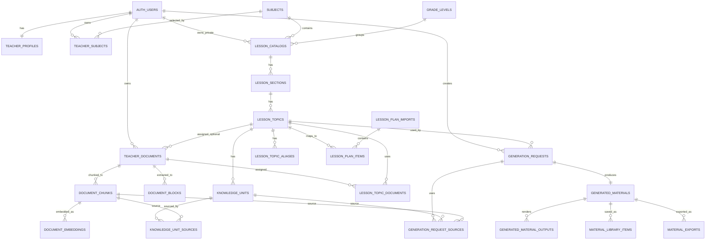

# SmartTeacher — database_architecture_v1.md

**Status:** dokument roboczy  
**Data:** 02.07.2026  
**Projekt:** nowy Tailwind / `smartteacher-next`  
**Zakres:** docelowa mapa bazy danych SmartTeacher v1, bez wykonywania migracji SQL  
**Nie jest to jeszcze:** gotowa migracja SQL, finalny schemat produkcyjny, implementacja API, integracja z generatorem

---

## 0. Cel dokumentu

Celem tego pliku jest uporządkowanie docelowej architektury bazy danych SmartTeacher przed pisaniem migracji SQL.

SmartTeacher nie jest prostą aplikacją CRUD. To system, który łączy:

- konta nauczycieli,
- prywatne materiały nauczycieli,
- globalną bazę materiałów SmartTeacher,
- katalog przedmiotów, działów i tematów lekcji,
- import CSV / Librus,
- ingestion dokumentów DOCX/PDF,
- strukturę wiedzy podobną do `LearningUnits`,
- generator kart pracy, kartkówek i sprawdzianów,
- historię generowań,
- bibliotekę zapisanych materiałów,
- późniejszy semantic / hybrid search, shuffle i grupy A/B.

Dokument opisuje **tabele, odpowiedzialności i zależności**, ale nie tworzy jeszcze bazy.

---

## 1. Zasady architektoniczne

### 1.1. Najpierw struktura danych

SmartTeacher powinien rozwiązywać problemy jakości i routingu przez:

```text
strukturę danych
→ relacje
→ metadane
→ walidację
→ dopiero później prompt
```

Nie należy ratować aplikacji rozbudowanym promptem, jeśli problem można rozwiązać lepiej przez dane, schemat, parser, renderer lub walidację.

### 1.2. Jedna odpowiedzialność na tabelę

Tabele powinny mieć jasny zakres:

```text
katalog lekcji ≠ dokumenty nauczyciela
dokumenty nauczyciela ≠ chunki
chunki ≠ knowledge units
knowledge units ≠ wygenerowane materiały
historia generowań ≠ biblioteka materiałów
```

### 1.3. Prywatność nauczyciela

Każdy nauczyciel ma własne konto i dostęp wyłącznie do swoich materiałów prywatnych.

Nauczyciel może uczyć tego samego przedmiotu co inni nauczyciele, ale:

```text
nauczyciel A widzi tylko swoje prywatne pliki
nauczyciel B widzi tylko swoje prywatne pliki
globalna baza SmartTeacher może być wspólna
treść globalnej bazy SmartTeacher nie musi być widoczna w UI
```

### 1.4. CSV jest źródłem importu, nie źródłem prawdy

Plik CSV / Librus jest tylko wejściem.

Docelowy przepływ:

```text
CSV / Librus
→ import
→ walidacja
→ zapis do tabel
→ mapowanie na lesson_topic / lesson_key
→ listy select w UI
```

UI nie powinien czytać CSV bezpośrednio.

### 1.5. Brak roku szkolnego i brak klas 1a/1b/1c

Dla SmartTeacher istotny jest poziom nauczania, a nie konkretna klasa organizacyjna.

Zapisujemy:

```text
klasa_1
klasa_2
klasa_3
klasa_4
klasa_5
```

Nie zapisujemy:

```text
rok_szkolny
1a
1b
1c
```

Uzasadnienie: nauczyciel wgrywa materiały dla klas pierwszych, drugich itd., nie dla konkretnego oddziału i roku.

---

## 2. Główna oś danych

Docelowy routing ma opierać się na metadanych:

```text
subject
→ grade_level
→ section
→ subtopic
→ curriculum_level
→ language
→ lesson_key
```

Przykład:

```text
subject: informatyka
grade_level: klasa_1
section: programowanie
subtopic: prog_zmienne
curriculum_level: PP
language: C++
lesson_key: programowanie/prog_zmienne/PP/C++
```

`lesson_key` pozostaje stabilnym identyfikatorem dydaktycznym, ale w bazie relacyjnej powinien być wspierany przez `lesson_topic_id`.

---

## 3. Trzy warstwy danych

### 3.1. Katalog dydaktyczny

Odpowiada na pytania:

```text
Jaki przedmiot?
Jaki poziom klasy?
Jaki dział?
Jaki temat lekcji?
Jaki lesson_key?
```

Główne tabele:

```text
subjects
grade_levels
lesson_catalogs
lesson_sections
lesson_topics
lesson_topic_aliases
```

### 3.2. Źródła wiedzy

Odpowiadają na pytania:

```text
Skąd generator ma wziąć wiedzę?
Czy to baza SmartTeacher?
Czy to prywatne materiały nauczyciela?
Czy to tryb hybrydowy?
```

Główne tabele:

```text
teacher_documents
document_blocks
document_chunks
document_embeddings
lesson_topic_documents
knowledge_units
knowledge_unit_sources
```

### 3.3. Wyniki pracy generatora

Odpowiadają na pytania:

```text
Co nauczyciel zlecił?
Co zostało wygenerowane?
Co zapisano do biblioteki?
Co wyeksportowano?
```

Główne tabele:

```text
generation_requests
generation_request_sources
generated_materials
generated_material_outputs
material_library_items
material_exports
generation_usage_logs
```

---

## 4. Typy źródeł wiedzy

### 4.1. `smartteacher_base`

Globalna baza materiałów SmartTeacher.

Cechy:

- wspólna dla wielu nauczycieli,
- nauczyciel może widzieć listę tematów,
- nauczyciel nie musi widzieć treści bazy,
- generator może używać tych treści zgodnie z planem subskrypcji,
- `owner_id` dla tych danych jest `null` albo wskazuje konto administracyjne.

### 4.2. `teacher_private`

Prywatne materiały konkretnego nauczyciela.

Cechy:

- zawsze mają `owner_id`,
- widoczne tylko dla właściciela,
- mogą pochodzić z DOCX, później PDF i innych formatów,
- są przetwarzane do bloków, chunków i docelowo do `knowledge_units`.

### 4.3. `hybrid`

Tryb generowania korzystający z:

```text
bazy SmartTeacher
+
prywatnych materiałów nauczyciela
```

Ważne: `hybrid` nie oznacza używania materiałów innych nauczycieli.

---

## 5. Grupy tabel i zależności

---

# A. Konta, nauczyciele, subskrypcje i limity

## A1. `teacher_profiles`

**Odpowiedzialność:** profil aplikacyjny nauczyciela powiązany z Supabase Auth.

| Kolumna | Typ koncepcyjny | Uwagi |
|---|---|---|
| `id` | uuid PK | wewnętrzny identyfikator profilu |
| `user_id` | uuid FK → `auth.users.id` | właściciel konta |
| `display_name` | text | nazwa widoczna w aplikacji |
| `email` | text | kopia robocza z auth / do wyszukiwania |
| `role` | text | np. `teacher`, `admin` |
| `is_active` | boolean | blokada konta bez kasowania danych |
| `created_at` | timestamptz | data utworzenia |
| `updated_at` | timestamptz | data aktualizacji |

**Zależności:**

```text
auth.users
→ teacher_profiles
```

**RLS:**

```text
nauczyciel widzi tylko swój profil
admin / service_role widzi profile administracyjnie
```

---

## A2. `teacher_subjects`

**Odpowiedzialność:** przedmioty, które nauczyciel ma aktywne w SmartTeacher.

| Kolumna | Typ koncepcyjny | Uwagi |
|---|---|---|
| `id` | uuid PK |  |
| `owner_id` | uuid FK → `auth.users.id` | nauczyciel |
| `subject_id` | uuid FK → `subjects.id` | przedmiot |
| `is_active` | boolean | czy przedmiot jest widoczny w panelu |
| `created_at` | timestamptz |  |

**Zależności:**

```text
teacher_profiles / auth.users
subjects
→ teacher_subjects
```

**Uzasadnienie:** wielu nauczycieli może uczyć tego samego przedmiotu, a jeden nauczyciel może mieć kilka przedmiotów.

---

## A3. `subscription_plans`

**Odpowiedzialność:** definicje planów biznesowych.

| Kolumna | Typ koncepcyjny | Uwagi |
|---|---|---|
| `id` | uuid PK |  |
| `plan_key` | text unique | np. `free`, `base`, `private`, `hybrid` |
| `name` | text | nazwa planu |
| `can_use_smartteacher_base` | boolean | dostęp do bazy SmartTeacher |
| `can_upload_private_documents` | boolean | upload własnych materiałów |
| `can_use_hybrid_mode` | boolean | tryb mieszany |
| `monthly_generation_limit` | integer | limit miesięczny |
| `is_active` | boolean |  |

**Zależności:**

```text
subscription_plans
→ teacher_subscriptions
```

---

## A4. `teacher_subscriptions`

**Odpowiedzialność:** aktywna subskrypcja nauczyciela.

| Kolumna | Typ koncepcyjny | Uwagi |
|---|---|---|
| `id` | uuid PK |  |
| `owner_id` | uuid FK → `auth.users.id` | nauczyciel |
| `plan_id` | uuid FK → `subscription_plans.id` | plan |
| `status` | text | `active`, `trialing`, `paused`, `cancelled` |
| `current_period_start` | timestamptz | opcjonalnie |
| `current_period_end` | timestamptz | opcjonalnie |
| `created_at` | timestamptz |  |

**Uwagi:** na początku można mieć jedną ręcznie ustawioną subskrypcję testową dla konta Izabeli.

---

## A5. `generation_limits`

**Odpowiedzialność:** bieżące limity generowań.

| Kolumna | Typ koncepcyjny | Uwagi |
|---|---|---|
| `id` | uuid PK |  |
| `owner_id` | uuid FK → `auth.users.id` | nauczyciel |
| `period_key` | text | np. `2026-07` albo `lifetime_test` |
| `limit_total` | integer | przydzielony limit |
| `limit_used` | integer | zużycie |
| `limit_reserved` | integer | rezerwacje w toku |
| `created_at` | timestamptz |  |
| `updated_at` | timestamptz |  |

**Zależności:**

```text
teacher_profiles
teacher_subscriptions
→ generation_limits
→ generation_requests
```

**Ważne:** rezerwacja limitu powinna być atomowa. Jeśli generowanie kończy się błędem, rezerwacja powinna zostać zwolniona albo przeksięgowana zgodnie ze statusem.

---

# B. Katalog dydaktyczny

## B1. `subjects`

**Odpowiedzialność:** lista przedmiotów.

| Kolumna | Typ koncepcyjny | Uwagi |
|---|---|---|
| `id` | uuid PK |  |
| `subject_key` | text unique | np. `informatyka`, `programowanie_obiektowe` |
| `name` | text | nazwa w UI |
| `is_active` | boolean |  |
| `created_at` | timestamptz |  |

**Przykłady:**

```text
informatyka
programowanie_obiektowe
aplikacje_mobilne
aplikacje_desktopowe
```

---

## B2. `grade_levels`

**Odpowiedzialność:** poziom klasy bez roku szkolnego i bez oddziałów.

| Kolumna | Typ koncepcyjny | Uwagi |
|---|---|---|
| `id` | uuid PK |  |
| `grade_key` | text unique | `klasa_1`, `klasa_2` |
| `label` | text | `Klasa 1`, `Klasa 2` |
| `order_index` | integer | sortowanie |

**Nie dodajemy:**

```text
school_year
class_name = 1a / 1b / 1c
```

---

## B3. `lesson_catalogs`

**Odpowiedzialność:** katalog lekcji dla bazy SmartTeacher albo prywatny katalog nauczyciela.

| Kolumna | Typ koncepcyjny | Uwagi |
|---|---|---|
| `id` | uuid PK |  |
| `owner_id` | uuid nullable FK → `auth.users.id` | null dla bazy SmartTeacher |
| `source_type` | text | `smartteacher_base` albo `teacher_private` |
| `subject_id` | uuid FK → `subjects.id` | przedmiot |
| `grade_level_id` | uuid FK → `grade_levels.id` | poziom klasy |
| `curriculum_level` | text | np. `PP`, później `PR` |
| `language` | text nullable | np. `C++`, `Python`; nie każdy przedmiot musi mieć język |
| `title` | text | nazwa katalogu |
| `is_active` | boolean |  |
| `created_at` | timestamptz |  |

**Zależności:**

```text
subjects
grade_levels
auth.users / null
→ lesson_catalogs
```

**Przykład bazy SmartTeacher:**

```text
owner_id = null
source_type = smartteacher_base
subject = informatyka
grade_level = klasa_1
curriculum_level = PP
language = C++
```

**Przykład prywatny:**

```text
owner_id = Izabela
source_type = teacher_private
subject = informatyka
grade_level = klasa_1
curriculum_level = PP
language = C++
```

---

## B4. `lesson_sections`

**Odpowiedzialność:** działy w katalogu.

| Kolumna | Typ koncepcyjny | Uwagi |
|---|---|---|
| `id` | uuid PK |  |
| `catalog_id` | uuid FK → `lesson_catalogs.id` | katalog |
| `section_key` | text | np. `programowanie`, `algorytmika` |
| `display_name` | text | nazwa w UI |
| `order_index` | integer | sortowanie |
| `is_active` | boolean |  |

**UI:**

```text
select: Dział
→ lesson_sections.display_name
```

**Zależności:**

```text
lesson_catalogs
→ lesson_sections
```

---

## B5. `lesson_topics`

**Odpowiedzialność:** tematy lekcji w dziale.

| Kolumna | Typ koncepcyjny | Uwagi |
|---|---|---|
| `id` | uuid PK |  |
| `catalog_id` | uuid FK → `lesson_catalogs.id` | katalog |
| `section_id` | uuid FK → `lesson_sections.id` | dział |
| `lesson_key` | text | stabilny klucz dydaktyczny |
| `subtopic_key` | text | np. `prog_zmienne` |
| `display_title` | text | nazwa w UI |
| `order_index` | integer | sortowanie |
| `is_active` | boolean |  |
| `created_at` | timestamptz |  |

**UI:**

```text
select: Temat lekcji
→ lesson_topics.display_title
```

**Logika generatora:**

```text
lesson_topic_id
→ lesson_key
→ section_key
→ subtopic_key
→ curriculum_level
→ language
```

**Indeksy docelowe:**

```text
(catalog_id, section_id, is_active, order_index)
(lesson_key)
(catalog_id, lesson_key)
```

---

## B6. `lesson_topic_aliases`

**Odpowiedzialność:** mapowanie nazw z CSV/Librusa na istniejące tematy.

| Kolumna | Typ koncepcyjny | Uwagi |
|---|---|---|
| `id` | uuid PK |  |
| `lesson_topic_id` | uuid FK → `lesson_topics.id` | temat docelowy |
| `owner_id` | uuid nullable FK → `auth.users.id` | null dla aliasów globalnych |
| `source_system` | text | `librus`, `manual_csv` |
| `alias_title` | text | tytuł z CSV/Librusa |
| `is_active` | boolean |  |
| `created_at` | timestamptz |  |

**Uzasadnienie:** wiele tytułów z Librusa może mapować się na jeden temat SmartTeacher.

Przykład:

```text
Proste instrukcje warunkowe
Złożone instrukcje warunkowe
Instrukcja wyboru Switch
→ prog_warunki
```

**Zależności:**

```text
lesson_topics
→ lesson_topic_aliases
```

---

# C. Import CSV / Librus

## C1. `lesson_plan_imports`

**Odpowiedzialność:** pojedynczy import pliku CSV.

| Kolumna | Typ koncepcyjny | Uwagi |
|---|---|---|
| `id` | uuid PK |  |
| `owner_id` | uuid FK → `auth.users.id` | nauczyciel |
| `subject_id` | uuid FK → `subjects.id` | przedmiot |
| `grade_level_id` | uuid FK → `grade_levels.id` | poziom klasy |
| `source_system` | text | `librus`, `manual_csv` |
| `original_file_name` | text | nazwa pliku |
| `storage_path` | text nullable | jeśli plik CSV zapisujemy w Storage |
| `status` | text | `uploaded`, `parsed`, `mapped`, `error` |
| `row_count` | integer | liczba wierszy |
| `error_message` | text nullable | błąd importu |
| `created_at` | timestamptz |  |

**Zależności:**

```text
teacher_profiles / auth.users
subjects
grade_levels
→ lesson_plan_imports
```

---

## C2. `lesson_plan_items`

**Odpowiedzialność:** pojedyncze wiersze z importu CSV.

| Kolumna | Typ koncepcyjny | Uwagi |
|---|---|---|
| `id` | uuid PK |  |
| `import_id` | uuid FK → `lesson_plan_imports.id` | import |
| `owner_id` | uuid FK → `auth.users.id` | denormalizacja dla RLS i indeksów |
| `source_row_number` | integer | numer wiersza z CSV |
| `section_title` | text | dział z CSV |
| `topic_title` | text | temat z CSV |
| `mapped_lesson_topic_id` | uuid nullable FK → `lesson_topics.id` | wynik mapowania |
| `lesson_key` | text nullable | wygodny klucz po mapowaniu |
| `order_index` | integer | kolejność w pliku |
| `mapping_status` | text | `mapped`, `unmapped`, `ambiguous`, `ignored` |
| `created_at` | timestamptz |  |

**Zależności:**

```text
lesson_plan_imports
lesson_topics
→ lesson_plan_items
```

**Zastępuje / rozwija pilotażową tabelę:**

```text
private_lesson_plan_items
```

**RLS:**

```text
owner_id = auth.uid()
```

---

# D. Dokumenty nauczyciela i ingestion

## D1. `teacher_documents`

**Odpowiedzialność:** metadane plików nauczyciela.

| Kolumna | Typ koncepcyjny | Uwagi |
|---|---|---|
| `id` | uuid PK |  |
| `owner_id` | uuid FK → `auth.users.id` | nauczyciel |
| `lesson_topic_id` | uuid nullable FK → `lesson_topics.id` | temat lekcji, jeśli przypisany |
| `source_type` | text | `teacher_private` |
| `storage_bucket` | text | np. `teacher-documents` |
| `storage_path` | text | ścieżka w Storage |
| `original_file_name` | text | nazwa pliku |
| `mime_type` | text | typ pliku |
| `file_size_bytes` | bigint | rozmiar |
| `status` | text | `uploaded`, `extracted`, `chunked`, `embedded`, `ready`, `error` |
| `error_message` | text nullable | błąd ingestion |
| `created_at` | timestamptz |  |
| `updated_at` | timestamptz |  |

**Na początek obsługiwany format:**

```text
DOCX
```

**Później:**

```text
PDF
inne formaty
```

**RLS:**

```text
owner_id = auth.uid()
```

**Storage:**

Pliki powinny znajdować się w prywatnym bucketcie, a dostęp powinien być kontrolowany przez polityki Storage/RLS.

---

## D2. `document_blocks`

**Odpowiedzialność:** source-only bloki wyekstrahowane z dokumentu.

| Kolumna | Typ koncepcyjny | Uwagi |
|---|---|---|
| `id` | uuid PK |  |
| `document_id` | uuid FK → `teacher_documents.id` | dokument |
| `owner_id` | uuid FK → `auth.users.id` | denormalizacja dla RLS |
| `block_index` | integer | kolejność bloku |
| `block_type` | text | np. `paragraph`, `heading`, `table` |
| `content` | text | oryginalna treść bloku |
| `content_hash` | text | kontrola integralności |
| `created_at` | timestamptz |  |

**Ważne:** bez parafrazowania i bez dopisywania treści.

**Zależności:**

```text
teacher_documents
→ document_blocks
```

---

## D3. `document_chunks`

**Odpowiedzialność:** chunki zbudowane przez łączenie bloków źródłowych.

| Kolumna | Typ koncepcyjny | Uwagi |
|---|---|---|
| `id` | uuid PK |  |
| `document_id` | uuid FK → `teacher_documents.id` | dokument |
| `owner_id` | uuid FK → `auth.users.id` | denormalizacja dla RLS |
| `chunk_index` | integer | kolejność chunka |
| `content` | text | tekst chunka |
| `block_indices` | jsonb | zakres bloków źródłowych |
| `token_count` | integer nullable | przybliżona liczba tokenów |
| `content_hash` | text | kontrola integralności |
| `created_at` | timestamptz |  |

**Zależności:**

```text
document_blocks
→ document_chunks
```

---

## D4. `document_embeddings`

**Odpowiedzialność:** embeddingi chunków do semantic search.

| Kolumna | Typ koncepcyjny | Uwagi |
|---|---|---|
| `id` | uuid PK |  |
| `chunk_id` | uuid FK → `document_chunks.id` | chunk |
| `owner_id` | uuid FK → `auth.users.id` | denormalizacja dla RLS |
| `embedding_model` | text | np. model embeddingów |
| `embedding` | vector | pgvector |
| `created_at` | timestamptz |  |

**Nie wdrażać w pierwszym pakiecie.**

**Docelowy retrieval:**

```text
najpierw filtry strukturalne
→ potem lexical / semantic
→ opcjonalnie reranking
```

---

## D5. `lesson_topic_documents`

**Odpowiedzialność:** przypisanie dokumentów nauczyciela do tematu lekcji.

| Kolumna | Typ koncepcyjny | Uwagi |
|---|---|---|
| `id` | uuid PK |  |
| `owner_id` | uuid FK → `auth.users.id` | nauczyciel |
| `lesson_topic_id` | uuid FK → `lesson_topics.id` | temat lekcji |
| `document_id` | uuid FK → `teacher_documents.id` | dokument |
| `sort_order` | integer | kolejność użycia |
| `is_active` | boolean |  |
| `created_at` | timestamptz |  |

**Zastępuje / rozwija pilotażową tabelę:**

```text
private_lesson_documents
```

**Ważne:** ta tabela nie przechowuje treści, chunków ani embeddingów. Jest tylko mapą:

```text
temat lekcji
→ dokumenty źródłowe
```

---

# E. Struktura wiedzy podobna do LearningUnits

## E1. `knowledge_units`

**Odpowiedzialność:** ustrukturyzowana wiedza dydaktyczna, do której docelowo będzie sięgał generator.

| Kolumna | Typ koncepcyjny | Uwagi |
|---|---|---|
| `id` | uuid PK |  |
| `owner_id` | uuid nullable FK → `auth.users.id` | null dla bazy SmartTeacher |
| `source_type` | text | `smartteacher_base`, `teacher_private` |
| `lesson_topic_id` | uuid FK → `lesson_topics.id` | temat |
| `unit_type` | text | `concept`, `task`, `error`, `structure` |
| `content_json` | jsonb | treść zgodna z kontraktem LearningUnits |
| `quality_status` | text | `draft`, `validated`, `ready`, `error` |
| `is_active` | boolean |  |
| `created_at` | timestamptz |  |
| `updated_at` | timestamptz |  |

**Docelowy kontrakt:**

```text
concept
task
error
structure
```

zgodnie z obecną logiką `LearningUnits`.

**Ważne:** to jest most między:

```text
materiał nauczyciela
→ chunki
→ struktura podobna do LearningUnits
→ generator
```

---

## E2. `knowledge_unit_sources`

**Odpowiedzialność:** źródła, z których powstała dana jednostka wiedzy.

| Kolumna | Typ koncepcyjny | Uwagi |
|---|---|---|
| `id` | uuid PK |  |
| `knowledge_unit_id` | uuid FK → `knowledge_units.id` | jednostka |
| `document_id` | uuid nullable FK → `teacher_documents.id` | dokument |
| `chunk_id` | uuid nullable FK → `document_chunks.id` | chunk |
| `source_note` | text nullable | dodatkowa informacja |
| `created_at` | timestamptz |  |

**Zależności:**

```text
teacher_documents
document_chunks
knowledge_units
→ knowledge_unit_sources
```

**Cel:** audytowalność. Zawsze wiadomo, z jakiego pliku/chunka pochodzi treść.

---

# F. Generator, historia i biblioteka

## F1. `generation_requests`

**Odpowiedzialność:** pojedyncze zlecenie generowania.

| Kolumna | Typ koncepcyjny | Uwagi |
|---|---|---|
| `id` | uuid PK |  |
| `owner_id` | uuid FK → `auth.users.id` | nauczyciel |
| `lesson_topic_id` | uuid nullable FK → `lesson_topics.id` | wymagany dla karty/kartkówki |
| `section_id` | uuid nullable FK → `lesson_sections.id` | przydatny dla sprawdzianu z działu |
| `source_mode` | text | `smartteacher_base`, `teacher_private`, `hybrid` |
| `material_type` | text | `karta_pracy`, `kartkowka`, `sprawdzian` |
| `curriculum_level` | text | np. `PP` |
| `language` | text nullable | np. `C++` |
| `task_count` | integer | liczba zadań |
| `profiles` | jsonb | lista profili uczniów |
| `status` | text | `reserved`, `generating`, `completed`, `failed`, `cancelled` |
| `limit_reserved` | boolean | czy limit został zarezerwowany |
| `error_message` | text nullable | błąd |
| `created_at` | timestamptz |  |
| `completed_at` | timestamptz nullable |  |

**Zależności:**

```text
auth.users
lesson_topics
lesson_sections
generation_limits
→ generation_requests
```

**Ważne:** to jest historia wejścia, nie wynik.

---

## F2. `generation_request_sources`

**Odpowiedzialność:** zapis źródeł użytych w generowaniu.

| Kolumna | Typ koncepcyjny | Uwagi |
|---|---|---|
| `id` | uuid PK |  |
| `request_id` | uuid FK → `generation_requests.id` | generowanie |
| `knowledge_unit_id` | uuid nullable FK → `knowledge_units.id` | jednostka wiedzy |
| `chunk_id` | uuid nullable FK → `document_chunks.id` | chunk |
| `source_type` | text | `smartteacher_base`, `teacher_private` |
| `created_at` | timestamptz |  |

**Cel:** audytowalność generatora.

```text
wiemy, z jakich jednostek/chunków powstał materiał
```

---

## F3. `generated_materials`

**Odpowiedzialność:** logiczny wynik generowania.

| Kolumna | Typ koncepcyjny | Uwagi |
|---|---|---|
| `id` | uuid PK |  |
| `request_id` | uuid FK → `generation_requests.id` | zlecenie |
| `owner_id` | uuid FK → `auth.users.id` | nauczyciel |
| `title` | text | tytuł materiału |
| `material_type` | text | karta/kartkówka/sprawdzian |
| `student_document_json` | jsonb | materiał ucznia |
| `teacher_key_json` | jsonb | klucz odpowiedzi |
| `scoring_summary` | jsonb | punktacja/skala |
| `created_at` | timestamptz |  |

**Ważne:** jeden wynik logiczny może mieć wiele wariantów prezentacji/eksportu.

---

## F4. `generated_material_outputs`

**Odpowiedzialność:** wersje prezentacyjne wyniku.

| Kolumna | Typ koncepcyjny | Uwagi |
|---|---|---|
| `id` | uuid PK |  |
| `generated_material_id` | uuid FK → `generated_materials.id` | materiał |
| `owner_id` | uuid FK → `auth.users.id` | nauczyciel |
| `output_type` | text | `student`, `teacher_key` |
| `profile_key` | text nullable | np. `standard`, `adhd`, `asd` |
| `html_content` | text nullable | render HTML |
| `text_content` | text nullable | tekst |
| `created_at` | timestamptz |  |

**Cel:** rozdzielić dane logiczne od renderowanych wyjść.

---

## F5. `material_library_items`

**Odpowiedzialność:** biblioteka materiałów zapisanych przez nauczyciela.

| Kolumna | Typ koncepcyjny | Uwagi |
|---|---|---|
| `id` | uuid PK |  |
| `owner_id` | uuid FK → `auth.users.id` | nauczyciel |
| `generated_material_id` | uuid FK → `generated_materials.id` | materiał |
| `title` | text | nazwa w bibliotece |
| `tags` | jsonb nullable | tagi |
| `favorite` | boolean | ulubione |
| `notes` | text nullable | notatki nauczyciela |
| `saved_at` | timestamptz |  |

**Różnica względem historii:**

```text
history = co wygenerowano
library = co nauczyciel zapisał do ponownego użycia
```

---

## F6. `material_exports`

**Odpowiedzialność:** wygenerowane pliki eksportu.

| Kolumna | Typ koncepcyjny | Uwagi |
|---|---|---|
| `id` | uuid PK |  |
| `owner_id` | uuid FK → `auth.users.id` | nauczyciel |
| `generated_material_id` | uuid FK → `generated_materials.id` | materiał |
| `export_type` | text | `pdf`, `docx` |
| `storage_bucket` | text | bucket w Storage |
| `storage_path` | text | ścieżka pliku |
| `created_at` | timestamptz |  |

---

## F7. `generation_usage_logs`

**Odpowiedzialność:** techniczny log zużycia limitów i zdarzeń generatora.

| Kolumna | Typ koncepcyjny | Uwagi |
|---|---|---|
| `id` | uuid PK |  |
| `owner_id` | uuid FK → `auth.users.id` | nauczyciel |
| `request_id` | uuid FK → `generation_requests.id` | zlecenie |
| `event_type` | text | `reserved`, `completed`, `released`, `failed` |
| `limit_delta` | integer | zmiana limitu |
| `created_at` | timestamptz |  |

**Cel:** audyt limitów i rozliczeń.

---

## 6. Zależności globalne — mapa tekstowa

```text
auth.users
  → teacher_profiles
  → teacher_subjects
  → teacher_subscriptions
  → generation_limits

subjects
  → teacher_subjects
  → lesson_catalogs

grade_levels
  → lesson_catalogs
  → lesson_plan_imports

lesson_catalogs
  → lesson_sections
  → lesson_topics

lesson_topics
  → lesson_topic_aliases
  → lesson_plan_items
  → teacher_documents
  → lesson_topic_documents
  → knowledge_units
  → generation_requests

lesson_plan_imports
  → lesson_plan_items

teacher_documents
  → document_blocks
  → document_chunks
  → document_embeddings
  → lesson_topic_documents
  → knowledge_unit_sources

document_chunks
  → document_embeddings
  → knowledge_unit_sources
  → generation_request_sources

knowledge_units
  → knowledge_unit_sources
  → generation_request_sources

generation_requests
  → generation_request_sources
  → generated_materials
  → generation_usage_logs

generated_materials
  → generated_material_outputs
  → material_library_items
  → material_exports
```

---

## 7. Mermaid ERD — uproszczony diagram



---

## 8. RLS i bezpieczeństwo

### 8.1. Zasada podstawowa

Każda tabela z prywatnymi danymi nauczyciela musi mieć:

```text
owner_id
RLS enabled
policy: owner_id = auth.uid()
```

Dotyczy szczególnie:

```text
teacher_documents
document_blocks
document_chunks
document_embeddings
lesson_plan_imports
lesson_plan_items
lesson_topic_documents
generation_requests
generated_materials
generated_material_outputs
material_library_items
material_exports
generation_usage_logs
```

### 8.2. Baza SmartTeacher

Globalna baza SmartTeacher może mieć:

```text
owner_id = null
source_type = smartteacher_base
```

Polityki powinny rozdzielać:

```text
metadata visible in UI
content hidden from direct browser access
content accessible only through server/API generator
```

### 8.3. Service role

`service_role` może być używany wyłącznie po stronie serwera.

Nie wolno wystawiać `service_role` do przeglądarki.

Jeżeli API generatora używa `service_role`, musi samodzielnie pilnować zakresu:

```text
current user
source_mode
allowed subscription plan
allowed teacher_private rows
allowed smartteacher_base rows
```

### 8.4. Storage

Prywatne dokumenty nauczycieli powinny trafić do prywatnego bucketu.

Proponowane buckety:

```text
teacher-documents
material-exports
lesson-plan-imports
```

Dostęp do plików:

```text
teacher-documents
→ tylko właściciel albo backend

material-exports
→ właściciel wygenerowanego materiału

lesson-plan-imports
→ właściciel importu
```

---

## 9. Retrieval docelowy

Nie budujemy systemu wyłącznie na embeddingach.

Docelowa kolejność:

```text
1. Filtry strukturalne:
   owner_id / source_type / subject / grade_level / section / lesson_topic / curriculum_level / language / unit_type

2. Filtrowanie po trybie:
   smartteacher_base / teacher_private / hybrid

3. Lexical search:
   tekst, tytuły, aliasy, ts_vector

4. Semantic search:
   pgvector na chunkach / knowledge_units

5. Reranking:
   opcjonalnie później

6. Shuffle / grupy:
   dopiero po wybraniu właściwego zbioru kandydatów
```

---

## 10. Grupy A/B i shuffle

Grupy A/B nie powinny być osobnym źródłem wiedzy.

Docelowo:

```text
knowledge_units
→ kandydaci z właściwego tematu
→ selection strategy
→ shuffle / seed
→ grupa A
→ grupa B
```

Możliwe przyszłe kolumny:

```text
generation_requests.group_mode
generation_requests.shuffle_seed
generation_requests.group_count
generation_request_sources.group_label
```

Nie wdrażać przed stabilnym działaniem historii i knowledge units.

---

## 11. Mapowanie starego pilotażu na model docelowy

### 11.1. `private_lesson_plan_items`

Pilot:

```text
private_lesson_plan_items
```

Docelowo:

```text
lesson_plan_imports
lesson_plan_items
lesson_topic_aliases
lesson_topics
```

Pilot przechowywał jednocześnie:

```text
wiersz CSV
mapowanie na lesson_key
section
subtopic
curriculum_level
language
```

Docelowo te odpowiedzialności są rozdzielone:

```text
lesson_plan_imports = plik/import
lesson_plan_items = wiersze importu
lesson_topics = tematy w katalogu
lesson_topic_aliases = mapowania nazw z CSV/Librusa
```

### 11.2. `private_lesson_documents`

Pilot:

```text
private_lesson_documents
```

Docelowo:

```text
lesson_topic_documents
teacher_documents
document_blocks
document_chunks
document_embeddings
knowledge_units
```

Pilot mapował `lesson_key` na dokument.

Docelowo mapujemy:

```text
lesson_topic_id
→ teacher_document_id
→ chunks
→ knowledge_units
```

---

## 12. Etapy wdrażania

## Etap 1 — Identity + katalog dydaktyczny

**Cel:** stworzyć fundament pod pola `Dział` i `Temat lekcji`.

Tabele:

```text
teacher_profiles
subjects
grade_levels
teacher_subjects
lesson_catalogs
lesson_sections
lesson_topics
lesson_topic_aliases
```

Nie robimy jeszcze:

```text
uploadu plików
chunków
embeddingów
generatora
historii
biblioteki
```

Test:

```text
konto Izabeli
→ przedmiot informatyka
→ katalog SmartTeacher base
→ działy Algorytmika i Programowanie
→ tematy lekcji z LearningUnits
→ selecty w UI mogą być zasilone z bazy
```

---

## Etap 2 — Import CSV / Librus

Tabele:

```text
lesson_plan_imports
lesson_plan_items
```

Test:

```text
upload CSV
→ zapis importu
→ zapis wierszy
→ mapowanie tytułów z CSV na lesson_topic
→ lista tematów lekcji dla nauczyciela
```

---

## Etap 3 — Upload dokumentów nauczyciela

Tabele:

```text
teacher_documents
lesson_topic_documents
```

Storage:

```text
teacher-documents
```

Test:

```text
upload DOCX
→ zapis metadanych dokumentu
→ przypisanie do lesson_topic
→ nauczyciel widzi tylko swój dokument
```

---

## Etap 4 — Source-only ingestion

Tabele:

```text
document_blocks
document_chunks
```

Test:

```text
DOCX
→ bloki
→ chunki
→ audyt source-only
→ bez modelu
→ bez parafrazowania
```

---

## Etap 5 — Knowledge Units

Tabele:

```text
knowledge_units
knowledge_unit_sources
```

Test:

```text
chunki nauczyciela
→ ręczne lub półautomatyczne przypisanie do concept/task/error/structure
→ struktura podobna do LearningUnits
→ walidacja jakości
```

---

## Etap 6 — Generator request + historia

Tabele:

```text
generation_requests
generation_request_sources
generated_materials
generated_material_outputs
generation_usage_logs
```

Test:

```text
zlecenie generowania
→ rezerwacja limitu
→ wybór źródeł
→ zapis wyniku
→ zapis historii
→ zwolnienie/rejestracja limitu przy błędzie
```

---

## Etap 7 — Biblioteka i eksporty

Tabele:

```text
material_library_items
material_exports
```

Test:

```text
materiał z historii
→ zapisz do biblioteki
→ eksport DOCX/PDF
→ zapis ścieżki eksportu
```

---

## Etap 8 — Semantic / hybrid search

Tabele / rozszerzenia:

```text
document_embeddings
pgvector
opcjonalne indeksy wektorowe
opcjonalny reranking
```

Test:

```text
filtry strukturalne
→ semantic search
→ ranking wyników
→ źródła zapisane w generation_request_sources
```

---

## 13. Pierwszy rekomendowany pakiet SQL

Nie pisać od razu całej bazy.

Pierwszy pakiet powinien objąć tylko:

```text
teacher_profiles
subjects
grade_levels
teacher_subjects
lesson_catalogs
lesson_sections
lesson_topics
lesson_topic_aliases
```

Dlaczego:

```text
ustawia fundament pod UI generatora
ustawia lesson_key i lesson_topic_id
nie dotyka generatora
nie dotyka OpenAI
nie dotyka Supabase Storage
nie dotyka embeddingów
nie miesza starego MVP z nowym projektem
```

---

## 14. Decyzje zapisane w tym dokumencie

1. Każdy nauczyciel ma osobną tożsamość w bazie.
2. Nauczyciel widzi tylko własne prywatne materiały.
3. Wielu nauczycieli może uczyć tego samego przedmiotu.
4. CSV / Librus jest źródłem importu, nie źródłem prawdy.
5. UI generatora powinno pokazywać działy i tematy z bazy.
6. Nie zapisujemy roku szkolnego.
7. Nie zapisujemy klas typu `1a`, `1b`, `1c`.
8. Zapisujemy poziom: `klasa_1`, `klasa_2`, itd.
9. Globalna baza SmartTeacher może być używana przez generator, ale jej treści nie muszą być widoczne w UI.
10. Prywatne materiały nauczyciela są przetwarzane do struktury podobnej do `LearningUnits`.
11. `lesson_key` pozostaje stabilnym kluczem dydaktycznym.
12. W bazie relacyjnej głównym kluczem operacyjnym powinien być `lesson_topic_id`.
13. Retrieval: najpierw metadane i filtry, potem semantic/hybrid search.
14. Historia generowań i biblioteka materiałów są osobnymi modułami.
15. Semantic search, shuffle, grupy A/B i reranking są etapami późniejszymi.
16. Testujemy najpierw na koncie Izabeli.
17. Nie podłączamy Private RAG do generatora bez osobnego etapu.
18. Nie przepisujemy starego działającego silnika tylko dlatego, że powstał nowy UI.

---

## 15. Otwarte decyzje

Do doprecyzowania przed SQL:

1. Czy `teacher_profiles.id` ma być osobnym UUID, czy takim samym jak `auth.users.id`?
2. Czy `lesson_catalogs.owner_id = null` wystarczy dla bazy SmartTeacher, czy tworzymy konto administracyjne właściciela?
3. Czy język programowania (`C++`, `Python`) ma być zwykłym polem tekstowym, enumem czy osobną tabelą?
4. Czy nauczyciel będzie mógł mieć wiele prywatnych katalogów dla tego samego przedmiotu i klasy?
5. Czy baza SmartTeacher ma mieć własne `teacher_documents`, czy od razu `knowledge_units` bez plików źródłowych?
6. Czy `knowledge_units.content_json` ma przechowywać pełną strukturę podobną do LearningUnits, czy rozbijamy ją na osobne tabele?
7. Jak długo przechowujemy historię generowań dla darmowego/płatnego planu?
8. Czy eksporty PDF/DOCX przechowujemy trwale w Storage, czy generujemy na żądanie?
9. Czy biblioteka materiałów ma mieć foldery, tagi, czy oba mechanizmy?
10. Kiedy dodajemy `pgvector`: przed czy po pierwszej stabilnej wersji Private Knowledge Base?

---

## 16. Źródła projektowe

- `WORKFLOW_RULES.md`
- `plan.md`
- `portfolio.md`
- `smartteacher_etapy.md`
- `private_lesson_plan_items.sql`
- `private_lesson_documents.sql`
- `librus_topic_mapping.csv`
- aktualny kod nowego projektu Tailwind

---

## 17. Źródła zewnętrzne do sprawdzenia przy SQL

Do etapu SQL należy wrócić do oficjalnej dokumentacji:

- Supabase Auth — zarządzanie danymi użytkownika i relacje z `auth.users`
- Supabase Database — primary keys, foreign keys, tabele
- Supabase Row Level Security — RLS dla danych użytkowników
- Supabase Storage Access Control — prywatne buckety i polityki Storage
- Supabase pgvector / AI & Vectors — embeddingi i semantic search

---

## 18. Następny krok

Następny bezpieczny krok:

```text
przygotować pierwszą migrację SQL tylko dla Etapu 1:
teacher_profiles
subjects
grade_levels
teacher_subjects
lesson_catalogs
lesson_sections
lesson_topics
lesson_topic_aliases
```

Nie tworzyć jeszcze:

```text
document_chunks
document_embeddings
knowledge_units
generation_requests
generated_materials
material_library_items
material_exports
```

Dopiero po zaakceptowaniu Etapu 1 przejść do migracji SQL i testu na koncie Izabeli.
